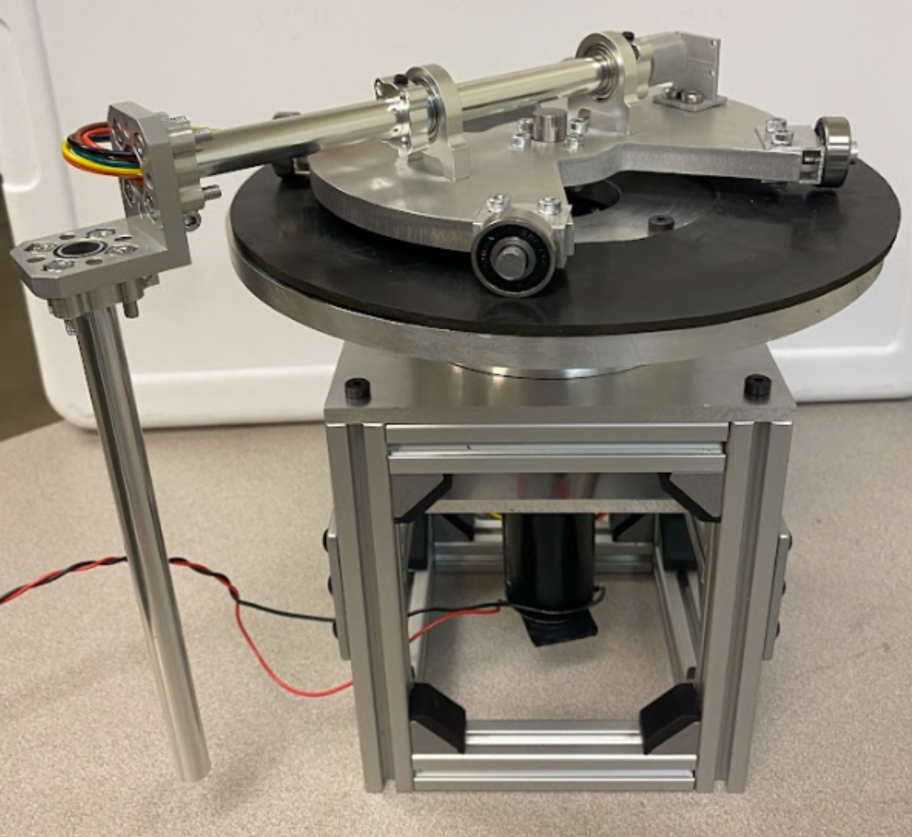
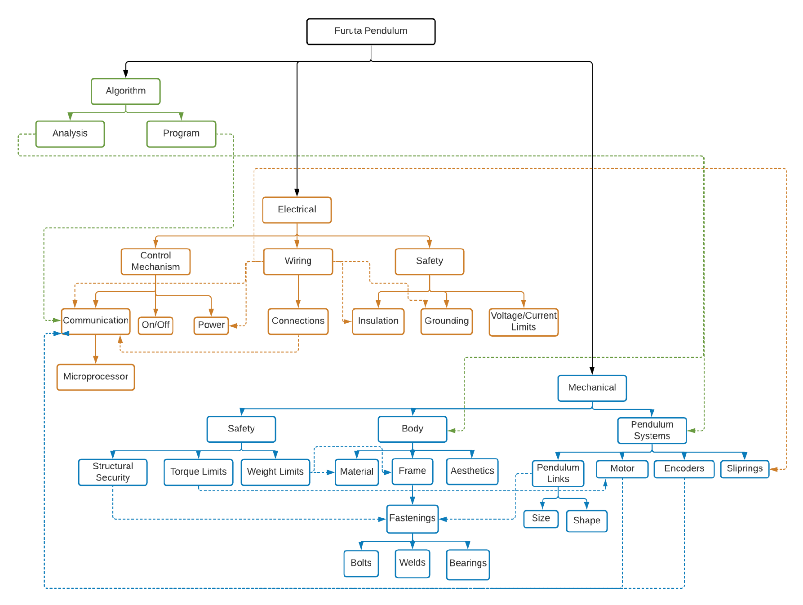

## Overview

This project was completed for Boise State University’s Robot Control Laboratory and focuses on designing a **Furuta inverted pendulum** capable of rotating a full 360° indefinitely without tangling wires or relying on additional gearboxes. The design emphasizes **low friction, tight tolerances, and structural rigidity** to ensure smooth motion under motor torque, while keeping the system compact (≤31×31×56 cm) and lightweight (<2 kg, excluding frame) with a total cost under $1,000.

The system is composed of three main components: **Mechanical System, Electrical System, and Control Algorithm**. A decision matrix guided the design process by integrating the strengths of existing market pendulums with custom solutions to meet the sponsor’s specifications. Key features include a **removable top and outer frame** for easy assembly, maintenance, and fabrication.  

The resulting design enables reliable 360° rotation, meets all sponsor requirements, and provides a robust platform for control algorithm testing and system analysis.

### Problem Analysis
Key challenges included:
- Enabling **360° continuous rotation** without tangling wires, addressed with a **slip ring** for the magnetic encoder.  
- Defining a **nominal operating torque** to ensure smooth rotation.  
- Keeping the system lightweight and compact (≤31×31×56 cm, <2 kg) while maintaining structural rigidity.  
- Ensuring the pendulum links rotate freely under motor torque without flexing.  

The system assumptions include rigidly coupled links, negligible motor rotor inertia, and diagonal inertia tensors for accurate modeling. Governing equations were developed to guide both the mechanical design and the control algorithm.

### Design Analysis
The design incorporates:
- A **RE 40 motor** (150 W, 187 mN-m nominal torque) capable of spinning Link 1 continuously up to 360° at a limited 250 RPM.  
- A **removable top and outer frame** for easy assembly, maintenance, and modifications.  
- Bearings and low-friction joints to minimize resistance and support smooth rotation of Link 2.  
- Integration with a **control algorithm** provided by the lab, enabling predictive motion and upright balance of the pendulum.  

A decision matrix was used to select features from existing pendulum designs and adapt them to meet sponsor requirements, balancing torque, friction, and accessibility.

### Design Testing
The system underwent four key testing phases:

1. **Strength Test:** Verified that the motor, frame, and pendulum subassembly could withstand axial forces and applied torques. The assembly passed without component failure.  

2. **Friction Test:** Evaluated bearings and rotating joints for smooth motion. Only three of four platform bearings were used to distribute weight effectively, which was sufficient for operation.  

3. **Integration Test:** Ensured all subassemblies connected correctly and operated smoothly without interference. The pendulum passed all integration checks.  

4. **Control Test:** Verified the supplied control algorithm’s ability to balance Link 2 upright. Initial testing required **adding 63.5 g** to the tip of Link 2 to achieve stable balance, after which the system performed reliably.  

All test results and detailed procedures are documented in **Appendix D** of the project report.

4. **Control Test:** Verified the supplied control algorithm’s ability to balance Link 2 upright. Initial testing required **adding 63.5 g** to the tip of Link 2 to achieve stable balance, after which the system performed reliably.  

All test results and detailed procedures are documented in **Appendix D** of the project report.
